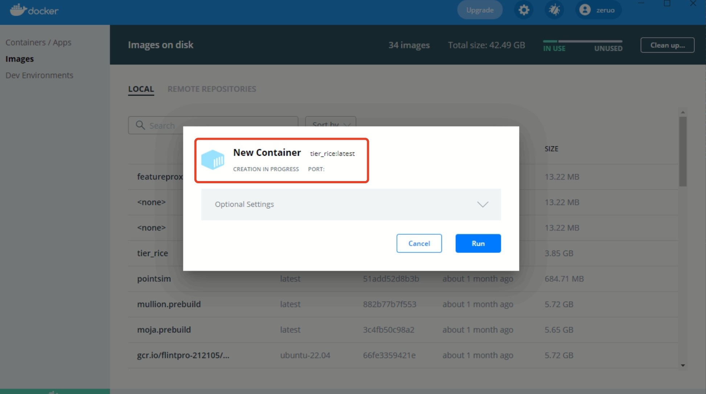

# IPCC Tier 1 CH4 Emissions from Rice
[](#contributors)

## **Backgrounds**:
This Tier 1 Rice module is developed based on [IPCC papers chapter 5.5 METHANE EMISSIONS FROM RICE
CULTIVATION page 49](https://www.ipcc-nggip.iges.or.jp/public/2019rf/pdf/4_Volume4/19R_V4_Ch05_Cropland.pdf) and [IPCC 2019 Refinement: AFOLU presentation slide](https://www.nies.go.jp/gio/en/wgia/jqjm1000000k8ja2-att/2-6_Session_2_India.pdf) calculations and equations. The implementation of our module include the concept of frequency that is generated by uniform random seeds to define the frequency of different events happened in the same year. We use [Windows development](#windows-environment) environment to develop and test and [Docker environment](#docker-environment) for a quick test run. 

## **Windows Environment**: 
* Visual Studio 16 2019 Win64
* CMake
* [moja flint](https://github.com/moja-global/FLINT)
* [vcpkg](https://github.com/moja-global/vcpkg)

### Building the project

Assuming you have followed the [moja flint](https://github.com/moja-global/FLINT) documentation to build  the [vcpkg](https://github.com/moja-global/vcpkg) first and then build the [moja.flint](https://github.com/moja-global/FLINT) library in visual studio, the commands below should build your tier 1 rice project solution.

**NOTE**: Paths used in commands may be different on your system.

```powershell
# Create a build folder under the Source folder
mkdir -p source\build
cd source\build

cmake -G "Visual Studio 16 2019" -DCMAKE_INSTALL_PREFIX=C:\Development\Software\moja -DVCPKG_TARGET_TRIPLET=x64-windows -DENABLE_TESTS=OFF -DOPENSSL_ROOT_DIR=c:\Development\moja-global\vcpkg\installed\x64-windows -DCMAKE_TOOLCHAIN_FILE=c:\Development\moja-global\vcpkg\scripts\buildsystems\vcpkg.cmake ..
```
#### Important: You need to set the correct path to GDAL library in `config.json` file in
```FLINT.Module.Tier1_Rice/run_env/config/ ```
```json
{
    "Libraries": {
    	"moja.modules.gdal": {
            "library": "moja.modules.gdald.dll",
            "path": "C:/Development/moja-global/FLINT/Source/build/bin/Debug",
            "type": "external"
        }
}
```
Change `"path": "C:/Development/moja-global/FLINT/Source/build/bin/Debug",` to the path where FLINT is installed and the directory with moja.modules.gdald.dll that gdal is built.
If FLINT is installed in `C:/Development/moja-global/FLINT`, then the path for GDAL will be `C:/Development/moja-global/FLINT/Source/build/bin/Debug`

**For example the `config.json` and `point_config.json` file libraries should look like this :**
 ```json
{
  "Libraries":{
   "moja.modules.tier1_rice": {
      "library": "moja.modules.tier1_riced.dll",
      "path": "%LOCAL_LIBS%",
      "type": "external"
    },
    "moja.modules.gdal": {
      "library": "moja.modules.gdald.dll",
      "path": "%MOJA_LIBS%",
      "type": "external"
      }
   }
}
 ```

### Running the project

We want to run with the `moja.cli.exe` from the moja.FLINT project, but debug in our current IDE in the source/build file generated.

The solution is to use properties to setup a Debug run in the IDE, making the command run `moja.cli.exe`. We can open the built `tier1_rice.sln` file in visual studio and set `moja.modules.tier1_rice` as start up project. 

**NOTE** : All paths used below with `C:\Development\moja-global` will need to be modified to match your system build location of the moja flint project.

#### Test Module Example

Then come to the properties and the settings required in VS2019 are:

```
# Command
C:\Development\moja-global\FLINT\Source\build\bin\Debug\moja.cli.exe

# Command Args for point example
--config point_config.json --config_provider provider_config.json
 
# Command Args for spatial example
--config config.json --config_provider provider_config.json

# Working Directory
..\..\..\run_env

# Environment
PATH=C:\Development\moja-global\vcpkg\installed\x64-windows\debug\bin;C:\Development\moja-global\FLINT\Source\build\bin\Debug;%PATH%
LOCAL_LIBS=$(OutDir)
```

With Envs: `PATH` for various libraries built in the Moja stage and `LOCAL_LIBS` so we can modify the explicit path for our example config to load libraries from this vs build (the default is the same location as the `moja.cli.exe`).

To match this, the example point config uses an environment variable in the library path:

```json
{
  "Libraries": {
   "moja.modules.tier1_rice": {
      "library": "moja.modules.tier1_riced.dll",
      "path": "%LOCAL_LIBS%",
      "type": "external"
    }
  }
}
```

**NOTE** : You can also generate your rasters yourself from geojson files or use our example raster files. If the geojson files are changed, we should change the -te extent based on the [GDAL requiements](https://gdal.org/programs/gdal_rasterize.html). The extent can be based on gdalinfo or [ogrinfo](https://gdal.org/drivers/vector/geojson.html)
```
# example command to get extent of geojson
ogrinfo single_rice.geojson -al -oo FLATTEN_NESTED_ATTRIBUTES=yes 

# you can see in results -- Extent: (145.991678, -34.962614) - (146.015167, -34.944418) 
```
You can change the extent based on the gdal information but remember the simulation is recommented to be rasterized as several whole tile raster, so we need to extend the extent when we generate rasters that can holds all the blocks areas. for example (145.991678, -34.962614) - (146.015167, -34.944418) is extended to ` -te 145.0 -35.0 147 -34.0`  which include all the simulated area of running blocks. The empty raster data input for running blocks will stop and get errors. if you see some warning and errors related to ` band : Access window out of range in RasterIO().  Requested (400,0) of size 400x400 on raster of 480x280`, that means the generated raster area is not big enough for your run.


Our raster files are generated from geojson files as following. 
```
# Rice events raster for "admin_level_3"
gdal_rasterize spatial_input/single_rice.geojson -a "ID" -te 145.0 -35.0 147 -34.0 -co "TILED=yes" -co "COMPRESS=DEFLATE" -tr 0.00025 0.00025 -ot Byte -a_nodata 255  rasters/single_rice.tif

# Region raster for "region"
gdal_rasterize spatial_input/region.geojson -a "OBJECTID" -te 145.0 -35.0 147 -34.0 -co "TILED=yes" -co "COMPRESS=DEFLATE" -tr 0.00025 0.00025 -ot Byte -a_nodata 255  rasters/region.tif
```

**NOTE** : You can also use our written script tools to check what tiles and blocks are available to the simulation based on your spatial file. Running this script requires you install [Python](https://www.python.org/downloads/) and [fiona](https://pypi.org/project/Fiona/) library. it will generate a block_list json file if you run [bound_to_blocks.py](./run_env/spatial_input/bound_to_blocks.py). You can change the tile and block information in fields of [windows config](./run_env/config.json) or [docker config](./docker_env/config.json).  
```
# come into the directory of run_env/spatial_input to run script
python bound_to_blocks.py -i your_geojson_filename

# Check the tile and block lists of 'single_rice.geojson' file
python bound_to_blocks.py -i single_rice.geojson

```

Your can replace the tile_index and block_index number or add more blocks need to be simulated. 
```json
		"landscape": {
			"iteration_type": "BlockIndex",
			"num_threads": 0,
			"provider": "FlintTiled",
			"blocks": [
				{
					"tile_index": 44966,
					"block_index": 90
				},
        {
					"tile_index": 44965,
					"block_index": 99
				}
			]
		}
```

## **Docker Environment**: 
* [Docker](https://docs.docker.com/desktop/install/mac-install/)
* Git

Signup to GitHub and gain access to tier1 rice module repository. Then should be able to run following commands in powershell.

```
git clone https://github.com/MullionGroup/FLINT.Module.Tier1_Rice.git  

cd FLINT.Module.Tier1_Rice
```

You can follow the instructions of intalling [docker for mac](https://docs.docker.com/desktop/install/mac-install/), [docker for windows](https://docs.docker.com/desktop/install/windows-install/), [docker for linux](https://docs.docker.com/desktop/install/linux-install/).
After installation, select and start Docker and keep it running on the machine. The related information how to run docker is [here](https://docs.docker.com/get-started/). 

First docker pull the base image `ghcr.io/moja-global/flint.core:master`, and then build the tier rice module by [Dockerfile](./Dockerfile) (probably need to set the GITHUB_AT information and right branch name in the [Dockerfile](./Dockerfile) before the step of docker build, the GITHUB_AT should be replaced by [your personal access token](https://docs.github.com/en/enterprise-server@3.4/authentication/keeping-your-account-and-data-secure/creating-a-personal-access-token) with ARG GITHUB_AT = your_token) with following commands:
```
docker pull ghcr.io/moja-global/flint.core:master 

docker build --no-cache -t tier1_rice:latest .

```
If docker build successfully, you should be able to see tier1_rice modules in the images list as following shows. 


And then click this image `RUN` to build a new container as following. 



set the container name as you like, my name is elegant_fermi, so you can see this container in containers list. 


click this container and try to open its cli.


we have set up a container for this image and now we want to come into path `/usr/local/bin` in the container environment in using this command `cd /usr/local/bin` in this cli window. 

We should be able to run the following point and spatial example under this path in this command line window.


```
# Command in Docker for point example
moja.cli --config ../src/FLINT.Module.Tier1_Rice/docker_env/point_config.json --config_provider  ../src/FLINT.Module.Tier1_Rice/docker_env/provider_config.json

# Command in Docker for spatial example
moja.cli --config ../src/FLINT.Module.Tier1_Rice/docker_env/config.json --config_provider  ../src/FLINT.Module.Tier1_Rice/docker_env/provider_config.json

```
**NOTE** : The default run use the [rasters](./run_env/rasters/) generated by [geojson](./run_env/spatial_input/) and [database](./run_env/database.db) with rice activities. You can change the raster files that represent the rice activities and regions, or change the data in `activity` and `rice_events` table in database (other tables are scaling and emission factors in the calculations).

If point simulation runs successfully, the following should be printed in the docker command line windows after running the moja.cli commands.

```
<2022-10-13 22:23:49.696742> (info) - Config has files: 1
<2022-10-13 22:23:49.700855> (info) - Using Logging Configuration: internal default
<2022-10-13 22:23:49.700913> (info) - Using configurations:
<2022-10-13 22:23:49.700927> (info) - ../src/FLINT.Module.Tier1_Rice/docker_env/point_config.json
<2022-10-13 22:23:49.701766> (info) - Using provider configurations:
<2022-10-13 22:23:49.701826> (info) - ../src/FLINT.Module.Tier1_Rice/docker_env/provider_config.json
<2022-10-13 22:23:49.771601> (info) - Using operation manager:
<2022-10-13 22:23:50.546564> (info) - modules loaded:
<2022-10-13 22:23:50.546775> (info) -   library: internal.flint, module name: CalendarAndEventFlintDataSequencer
<2022-10-13 22:23:50.546841> (info) -   library: internal.flint, module name: OutputerStream
<2022-10-13 22:23:50.546885> (info) -   library: internal.flint, module name: OutputerStreamFlux
<2022-10-13 22:23:50.546900> (info) -   library: internal.flint, module name: TransactionManagerEndOfStepModule
<2022-10-13 22:23:50.546961> (info) -   library: moja.modules.tier1_rice, module name: DisturbanceEventModule
<2022-10-13 22:23:50.547002> (info) - Operation manager: Simple, Version: 1.0, Config: (Kahan[OFF], ZeroTransfers[OFF], AllowNegativeTransfers[ON], WarnNegativeTransfers[OFF])
OutputerStream
==========================================================================
Started:Thu Oct 13 22:23:50 2022 UTC
==========================================================================
notification,step,stepDate,fracOfStep,stepLenInYears,CH4,Rice,
onTimingPostInit,0,1959-12-31:23:59:59.998999,1,0.0846995,0,0,
onOutputStep,1,1960-01-31:23:59:59.999999,1,0.0846994535519126,0,0,
onOutputStep,2,1960-02-29:23:59:59.999999,1,0.0792349726775956,0,0,
onOutputStep,3,1960-03-31:23:59:59.999999,1,0.0846994535519126,0,0,
onOutputStep,4,1960-04-30:23:59:59.999999,1,0.0819672131147541,0,0,
onOutputStep,5,1960-05-31:23:59:59.999999,0.983870967741935,0.0846994535519126,0.000514229444900756,-0.000514229444900756,
onOutputStep,6,1960-06-30:23:59:59.999999,1,0.0819672131147541,0.000514229444900756,-0.000514229444900756,
onOutputStep,7,1960-07-31:23:59:59.999999,1,0.0846994535519126,0.000514229444900756,-0.000514229444900756,
onOutputStep,8,1960-08-31:23:59:59.999999,1,0.0846994535519126,0.000514229444900756,-0.000514229444900756,
onOutputStep,9,1960-09-30:23:59:59.999999,1,0.0819672131147541,0.000514229444900756,-0.000514229444900756,
onOutputStep,10,1960-10-31:23:59:59.999999,1,0.0846994535519126,0.000514229444900756,-0.000514229444900756,
onOutputStep,11,1960-11-30:23:59:59.999999,1,0.0819672131147541,0.000514229444900756,-0.000514229444900756,
onOutputStep,12,1960-12-31:23:59:59.999999,1,0.0846994535519126,0.000514229444900756,-0.000514229444900756,
onOutputStep,13,1961-01-31:23:59:59.999999,1,0.0849315068493151,0.000514229444900756,-0.000514229444900756,
onOutputStep,14,1961-02-28:23:59:59.999999,1,0.0767123287671233,0.000514229444900756,-0.000514229444900756,
onOutputStep,15,1961-03-31:23:59:59.999999,1,0.0849315068493151,0.000514229444900756,-0.000514229444900756,
onOutputStep,16,1961-04-30:23:59:59.999999,1,0.0821917808219178,0.000514229444900756,-0.000514229444900756,
onOutputStep,17,1961-05-31:23:59:59.999999,1,0.0849315068493151,0.000514229444900756,-0.000514229444900756,
onOutputStep,18,1961-06-30:23:59:59.999999,1,0.0821917808219178,0.000514229444900756,-0.000514229444900756,
onOutputStep,19,1961-07-31:23:59:59.999999,1,0.0849315068493151,0.000514229444900756,-0.000514229444900756,
onOutputStep,20,1961-08-31:23:59:59.999999,1,0.0849315068493151,0.000514229444900756,-0.000514229444900756,
onOutputStep,21,1961-09-30:23:59:59.999999,1,0.0821917808219178,0.000514229444900756,-0.000514229444900756,
onOutputStep,22,1961-10-31:23:59:59.999999,1,0.0849315068493151,0.000514229444900756,-0.000514229444900756,
onOutputStep,23,1961-11-30:23:59:59.999999,1,0.0821917808219178,0.000514229444900756,-0.000514229444900756,
onOutputStep,24,1961-12-31:23:59:59.999999,1,0.0849315068493151,0.000514229444900756,-0.000514229444900756,
onOutputStep,25,1962-01-31:23:59:59.999999,1,0.0849315068493151,0.000514229444900756,-0.000514229444900756,
==========================================================================
Finished:Thu Oct 13 22:23:50 2022 UTC
==========================================================================

```


If spatial simulation runs successfully, the following results should be printed in the docker command line windows after running the moja.cli commands.

```
<2022-10-13 22:41:31.724521> (info) - Config has files: 1
<2022-10-13 22:41:31.724671> (info) - Using Logging Configuration: internal default
<2022-10-13 22:41:31.724719> (info) - Using configurations:
<2022-10-13 22:41:31.724752> (info) - ../src/FLINT.Module.Tier1_Rice/docker_env/config.json
<2022-10-13 22:41:31.724772> (info) - Using provider configurations:
<2022-10-13 22:41:31.724799> (info) - ../src/FLINT.Module.Tier1_Rice/docker_env/provider_config.json
<2022-10-13 22:41:31.737899> (info) - Using operation manager: Simple
<2022-10-13 22:41:31.803657> (info) -   0:Queuing block: ( 44966, 90) 1 of 2
<2022-10-13 22:41:31.805589> (info) -   0:Queuing block: ( 44965, 99) 2 of 2
<2022-10-13 22:41:31.806637> (info) -   0:Total Blocks queued for simulation: 2
<2022-10-13 22:41:31.806760> (info) -   0:Run ID = '2f159d28-4b48-11ed-a4bd-0242ac110002'
<2022-10-13 22:41:31.806815> (info) - modules loaded:
<2022-10-13 22:41:31.806954> (info) -   library: internal.flint, module name: CalendarAndEventFlintDataSequencer
<2022-10-13 22:41:31.806995> (info) -   library: internal.flint, module name: TransactionManagerEndOfStepModule
<2022-10-13 22:41:31.807051> (info) -   library: moja.modules.gdal, module name: WriteVariableGeotiff
<2022-10-13 22:41:31.807121> (info) -   library: moja.modules.tier1_rice, module name: AggregatorError
<2022-10-13 22:41:31.807169> (info) -   library: moja.modules.tier1_rice, module name: AggregatorLandUnit
<2022-10-13 22:41:31.807216> (info) -   library: moja.modules.tier1_rice, module name: BuildLandUnitModule
<2022-10-13 22:41:31.807269> (info) -   library: moja.modules.tier1_rice, module name: DisturbanceEventModule
<2022-10-13 22:41:31.807328> (info) -   library: moja.modules.tier1_rice, module name: LandUnitSQLiteWriter
<2022-10-13 22:41:31.807384> (info) - Operation manager: Simple, Version: 1.0, Config: (Kahan[OFF], ZeroTransfers[OFF], AllowNegativeTransfers[ON], WarnNegativeTransfers[OFF])
<2022-10-13 22:41:31.833426> (info) - LandUnitSQLiteWriter resolved output path is - /usr/local/bin/data/output/results/dbs
<2022-10-13 22:41:35.619865> (info) -   0: Stats level [Block]: Record [    2 of     2]: Index [( 44966, 90)]: Time(ms) [Total:     3697, Processed:      876]: Units [Total:   160000, Processed:     2708, NotProcessed:   157292, Errors:        0, LU/second:    43275]
<2022-10-13 22:41:38.014308> (info) -   0: Stats level [Block]: Record [    1 of     2]: Index [( 44965, 99)]: Time(ms) [Total:     2231, Processed:      231]: Units [Total:   160000, Processed:      717, NotProcessed:   159283, Errors:        0, LU/second:    71701]
<2022-10-13 22:41:38.084993> (info) -   0:Summary of processing by Tile
<2022-10-13 22:41:38.085215> (info) -   0: Stats level [Tile]: Index [( 44966)]: Time(sec) [Total:     3000, Processed:        0]: Units [Total:   160000, Processed:     2708, NotProcessed:   157292, Errors:        0, LU/second:    43275]
<2022-10-13 22:41:38.085313> (info) -   0: Stats level [Tile]: Index [( 44965)]: Time(sec) [Total:     2000, Processed:        0]: Units [Total:   160000, Processed:      717, NotProcessed:   159283, Errors:        0, LU/second:    71701]
<2022-10-13 22:41:38.085383> (info) -   0:Summary of processing for full run
<2022-10-13 22:41:38.085487> (info) -   0: Stats level [Global]: Time(sec) [Total:     5000, Processed:     1000]: Units [Total:   320000, Processed:     3425, NotProcessed:   316575, Errors:        0, LU/second:    53974]
<2022-10-13 22:41:38.085575> (info) -   0:Start Time           : Thu Oct 13 22:41:31 2022 UTC
<2022-10-13 22:41:38.085628> (info) -   0:Finish Time          : Thu Oct 13 22:41:38 2022 UTC
<2022-10-13 22:41:38.085661> (info) -   0:Total Time (seconds) : 6
<2022-10-13 22:41:38.116584> (info) - Loading date_dimension
<2022-10-13 22:41:38.121916> (info) - Loading poolinfo_dimension
<2022-10-13 22:41:38.127188> (info) - Loading tileinfo_dimension
<2022-10-13 22:41:38.132937> (info) - Loading locationnontemp_dimension
<2022-10-13 22:41:38.140585> (info) - Loading locationtemp_dimension

```

Then the point and spatial output file should be under the working directory of this docker container (`Example_Point_Flux.csv` and `Example_Point_Stock.csv` are under `/usr/local/bin/` while database file and spatial outputs under `/usr/local/bin/data/output/results`). We can copy these result files to local machine by running docker copy command on your local machine command powershell:
```
docker cp container_name:/usr/local/bin/Example_Point_Flux.csv tagert_local_path
# example: docker cp elegant_fermi:/usr/local/bin/Example_Point_Flux.csv D:/result/Example_Point_Flux.csv

docker cp container_name:/usr/local/bin/Example_Point_Stock.csv tagert_local_path
# example: docker cp elegant_fermi:/usr/local/bin/Example_Point_Stock.csv D:/result/Example_Point_Stock.csv

docker cp container_name:/usr/local/bin/data tagert_local_path
# example: docker cp elegant_fermi:/usr/local/bin/data D:/result
```
This example is with my container `elegant_fermi` and target path to `D:/result` , then the results are in `D:/result/data/output/results` with csv files, dbs and spatial_output files that represent the pool and flux of rice and CH4. 

## How to Get Involved?  

moja global welcomes a wide range of contributions as explained in [Contributing document](https://github.com/moja-global/About-moja-global/blob/master/CONTRIBUTING.md) and in the [About moja-global Wiki](https://github.com/moja-global/.github/wiki).  

  
## FAQ and Other Questions  

* You can find FAQs on the [Wiki](https://github.com/moja.global/.github/wiki).  
* If you have a question about the code, submit [user feedback](https://github.com/moja-global/About-moja-global/blob/master/Contributing/How-to-Provide-User-Feedback.md) in the relevant repository  
* If you have a general question about a project or repository or moja global, [join moja global](https://github.com/moja-global/About-moja-global/blob/master/Contributing/How-to-Join-moja-global.md) and 
    * [submit a discussion](https://help.github.com/en/articles/about-team-discussions) to the project, repository or moja global [team](https://github.com/orgs/moja-global/teams)
    * [submit a message](https://get.slack.help/hc/en-us/categories/200111606#send-messages) to the relevant channel on [moja global's Slack workspace](mojaglobal.slack.com). 
* If you have other questions, please write to info@moja.global   
  

## Contributors

Thanks goes to these wonderful people ([emoji key](https://allcontributors.org/docs/en/emoji-key)):

<!-- ALL-CONTRIBUTORS-LIST:START - Do not remove or modify this section -->
<!-- prettier-ignore -->
<table><tr><td align="center"><a href="http://moja.global"><br /><sub><b>moja global</b></sub></a><br /><a href="#projectManagement-moja-global" title="Project Management">📆</a></td></tr></table>

<!-- ALL-CONTRIBUTORS-LIST:END -->

This project follows the [all-contributors](https://github.com/all-contributors/all-contributors) specification. Contributions of any kind welcome!


## Maintainers Reviewers Ambassadors Coaches

The following people are Maintainers Reviewers Ambassadors or Coaches  
<table><tr><td align="center"><a href="http://moja.global"><br /><sub><b>moja global</b></sub></a><br /><a href="#projectManagement-moja-global" title="Project Management">📆</a></td></tr></table>


**Maintainers** review and accept proposed changes  
**Reviewers** check proposed changes before they go to the Maintainers  
**Ambassadors** are available to provide training related to this repository  
**Coaches** are available to provide information to new contributors to this repository  
